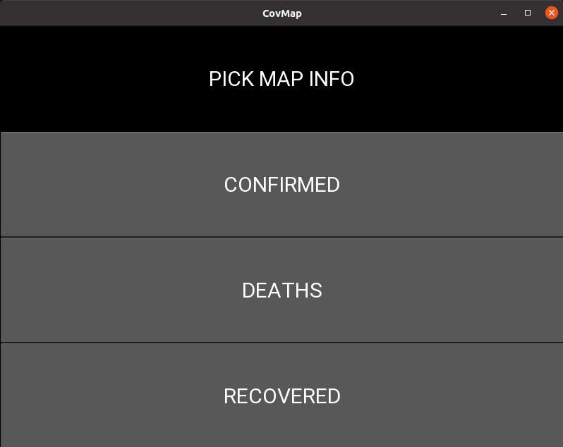
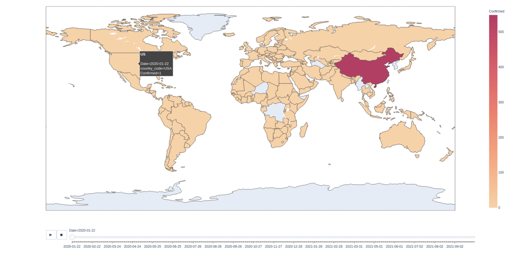

# Covid_Map

## The program was created to learn how to use data frames, how to make choropleth in `plotly` and how to write GUI in `kivy`. Kv file is an introduction to CSS. GUI is written with "request \ response" method where backend and frontend are in separate files.

## `plotly`, `pandas`, `kivy`, `pycountry`

### The program starts with simple Python GUI made in Kivy library with .kv file which is stuff like CSS.

### After choosing which data you need, a choropleth map will be generated. I may take some time.

### At the bottom of the map you can see a timeline showing the increase in cases from 01/22/20 until today.

### Choosing country will show: name of the country, the date, the country code and the number of cases.

### there are some errors in dataframe: after 14/12/20 US Recovery data disappears and the rest of it around August 2021.
